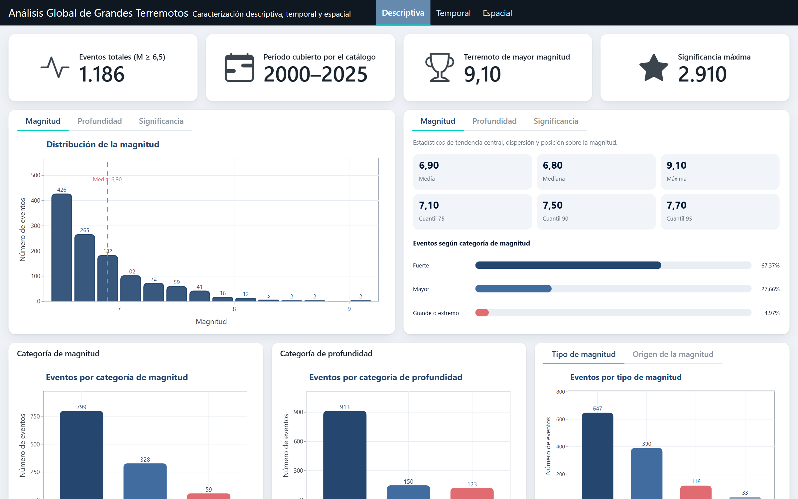
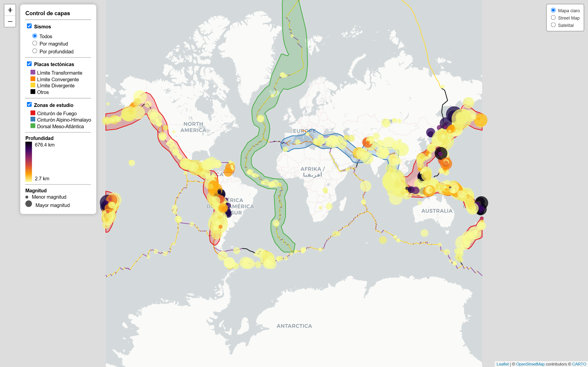
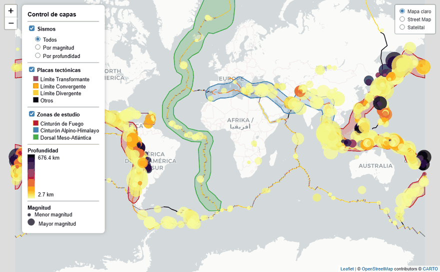
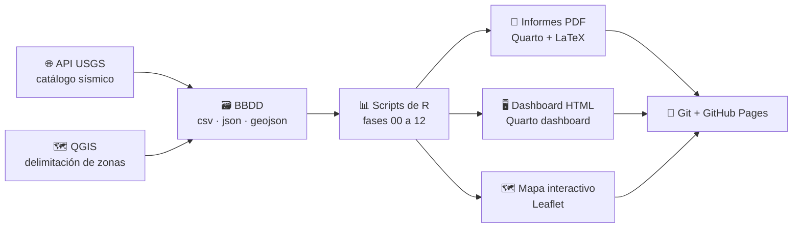

<div align="center">

# 🌎 Análisis Global de Grandes Terremotos

### Catálogo sísmico USGS 2000-2025 · Estadística descriptiva e inferencial por zonas sísmicas

[](https://www.r-project.org/)
[](https://quarto.org/)
[](https://leafletjs.com/)
[](https://qgis.org/)
[](https://www.latex-project.org/)
[](https://mariajosevn.github.io/USGS-earthquake-analysis/)

**[🖥️ Ver el dashboard](https://mariajosevn.github.io/USGS-earthquake-analysis/Dashboard/dashboard.html)** ·
**[🗺️ Ver el mapa interactivo](https://mariajosevn.github.io/USGS-earthquake-analysis/MAPA_HTML/mapa_interactivo_sismos_v2.html)** ·
**[📄 Leer los informes](#-informes)**

<table>
  <tr>
    <td width="50%" align="center">
      <a href="https://mariajosevn.github.io/USGS-earthquake-analysis/Dashboard/dashboard.html">
        
      </a>
      <br><sub><b>Dashboard interactivo</b> · indicadores, filtros y gráficos plotly</sub>
    </td>
    <td width="50%" align="center">
      <a href="https://mariajosevn.github.io/USGS-earthquake-analysis/MAPA_HTML/mapa_interactivo_sismos_v2.html">
        
      </a>
      <br><sub><b>Mapa interactivo</b> · sismos, placas tectónicas y zonas de estudio</sub>
    </td>
  </tr>
</table>

</div>

---

## 📌 Sobre el proyecto

Este proyecto analiza el catálogo sísmico del **USGS (United States Geological Survey)** para el período **2000-2025**, con foco en los grandes terremotos del planeta: **1.186 eventos de magnitud 6,5 o superior**. El objetivo es caracterizar dónde, cuándo y con qué intensidad ocurren estos sismos, y contrastar formalmente las diferencias entre las grandes zonas sísmicas del mundo.

Las zonas de estudio se delimitaron en **QGIS** a partir de los límites de placas tectónicas y luego se integraron al flujo de análisis en **R** mediante archivos geojson:

| Zona sísmica | Eventos | Porcentaje |
|---|---:|---:|
| 🔴 Cinturón de Fuego del Pacífico | 892 | 75,2 % |
| 🔵 Cinturón Alpino-Himalayo | 63 | 5,3 % |
| 🟢 Dorsal Meso-Atlántica | 28 | 2,4 % |
| ⚪ Resto del mundo | 203 | 17,1 % |

Algunos resultados que resume el dashboard: la magnitud media del catálogo es **6,90**, la mediana **6,80**, el terremoto de mayor magnitud alcanza **9,10** y la significancia máxima registrada es **2.910**.

## 🎬 El mapa en acción

<div align="center">
  <a href="https://mariajosevn.github.io/USGS-earthquake-analysis/MAPA_HTML/mapa_interactivo_sismos_v2.html">
    
  </a>
  <br><sub>Recorrido por el Cinturón de Fuego: Japón, la subducción chilena y la vista global. Haz clic para explorarlo en vivo.</sub>
</div>

El mapa se genera con **Leaflet desde R** ([USGS_Earthquake_map_V2.R](MAPA_HTML/USGS_Earthquake_map_V2.R)) y ofrece:

- **3 mapas base** (claro, callejero y satelital) y control de capas por grupo.
- **Sismos** con radio proporcional a la magnitud y color según profundidad (paleta inferno, de 2,7 km a 676,4 km).
- **Límites de placas tectónicas** clasificados en transformantes, convergentes y divergentes.
- **Zonas de estudio** dibujadas como polígonos con la misma delimitación usada en los informes.
- **Popups** con fecha, magnitud, profundidad y lugar de cada evento.

## 🔄 Flujo de trabajo



Todo el ciclo vive en este repositorio: los datos crudos entran por `BBDD/`, los scripts de R procesan y analizan por fases, y los tres productos finales (informes PDF, dashboard y mapa) se publican directamente desde el repo con GitHub Pages.

## 🧭 Estructura del repositorio

| Carpeta | Contenido |
|---|---|
| [`BBDD/`](BBDD) | Catálogo USGS en csv, json y geojson, más la base de significancia |
| [`Scripts/`](Scripts) | 16 scripts de R numerados por fase, de `00_preparacion_base.R` a `12_inf_sensibilidad.R` |
| [`Informes Quarto/`](Informes%20Quarto) | Informes de asesoría en `.qmd` con salida PDF vía LaTeX, plantilla `layout-control.tex` y bibliografía BibTeX |
| [`Dashboard/`](Dashboard) | `dashboard.qmd` (formato `dashboard` de Quarto), tema `estilos.scss` y helper de datos en R |
| [`MAPA_HTML/`](MAPA_HTML) | Script del mapa Leaflet, datos espaciales y el HTML publicado |
| [`SIG/`](SIG) | Proyecto QGIS (`.qgz`), GeoPackage y geojson con las zonas sísmicas |
| [`Bibliografia/`](Bibliografia) | Papers de referencia (Gutenberg y Richter 1944, Ogata 1988, Wiemer y Wyss 2000, entre otros) |
| [`Bitacora/`](Bitacora) | Notas de trabajo sobre los formatos de datos (csv, geoJSON) |

## 🧪 Metodología

El análisis se desarrolla en dos etapas, cada una respaldada por un informe:

**Etapa descriptiva** ([Informe Asesoría 1](Informes%20Quarto/Informe%20Asesoría%201/Informe%20Asesoría%201%20-%20Actual.pdf))

1. Preparación de la base y tratamiento de valores faltantes.
2. Análisis descriptivo de magnitud, profundidad y significancia, más variables categóricas.
3. Análisis temporal: evolución anual, estacionalidad y recurrencia.
4. Análisis espacial: asignación de eventos a zonas sísmicas.
5. Asociatividad entre variables.

**Etapa inferencial** ([Informe Asesoría 2](Informes%20Quarto/Informe%20Asesoría%202/Informe%20Asesoría%202%20-%20Actual.pdf))

6. Comparabilidad entre zonas y contrastes de frecuencia.
7. Comparación de magnitud y profundidad con **Kruskal-Wallis** y post hoc de **Dunn con corrección de Holm**.
8. Tamaños de efecto: **épsilon cuadrado**, **delta de Cliff** y **V de Cramér**.
9. Modelos de conteo (**Poisson** y **binomial negativa**) y **regresión multinomial** para la clasificación de zonas.
10. Eventos fuertes y extremos, simulación **Monte Carlo** y análisis de sensibilidad.

## 🔗 Integración Quarto + Git

Este proyecto se trabajó de punta a punta con herramientas reproducibles, como parte de una asesoría estadística académica:

- **Quarto para los informes**: cada informe es un `.qmd` que mezcla texto, código R y resultados, y compila a PDF con LaTeX (plantilla propia y bibliografía en BibTeX). El documento final siempre refleja el estado actual de los datos y del código.
- **Quarto para el dashboard**: el mismo ecosistema genera el dashboard HTML con `format: dashboard`, gráficos plotly, tablas DT y filtros crosstalk que funcionan sin servidor.
- **Git para el historial**: más de 380 commits en un mes de trabajo documentan cada avance, con un `.gitignore` que separa los artefactos de render del contenido versionado.
- **GitHub Pages para publicar**: el dashboard y el mapa se sirven directamente desde el repositorio, sin infraestructura adicional. Lo que se ve en vivo es exactamente lo que está commiteado.

## ⚙️ Reproducibilidad

Requisitos: **R 4.6 o superior**, **Quarto 1.4 o superior** y una distribución LaTeX (por ejemplo TinyTeX) para los PDF.

Paquetes de R principales: `dplyr`, `tidyr`, `lubridate`, `ggplot2`, `plotly`, `DT`, `crosstalk`, `htmlwidgets`, `sf`, `leaflet`, `viridis`, `stringr`.

```bash
# Mapa interactivo (desde la raíz del repositorio)
Rscript MAPA_HTML/USGS_Earthquake_map_V2.R

# Dashboard (desde la carpeta Dashboard)
cd Dashboard
quarto render dashboard.qmd --to dashboard

# Informes PDF
quarto render "Informes Quarto/Informe Asesoría 2/Informe Asesoría 2 - Actual.qmd"
```

## 📄 Informes

| Documento | Descripción |
|---|---|
| [Pre-Informe Asesoría 1](Informes%20Quarto/Pre-Informe%20Asesoría%201/Pre-Informe%20Asesoría%201.pdf) | Exploración inicial del catálogo |
| [Informe Asesoría 1](Informes%20Quarto/Informe%20Asesoría%201/Informe%20Asesoría%201%20-%20Actual.pdf) | Caracterización descriptiva, temporal y espacial |
| [Informe Asesoría 2](Informes%20Quarto/Informe%20Asesoría%202/Informe%20Asesoría%202%20-%20Actual.pdf) | Análisis inferencial y clasificación de zonas |

## 📚 Fuente de datos

- **Catálogo sísmico**: [USGS Earthquake Catalog](https://earthquake.usgs.gov/earthquakes/search/), eventos de magnitud 6,5 o superior entre 2000 y 2025.
- **Límites de placas tectónicas**: capa geojson de límites tectónicos globales.
- **Zonas sísmicas**: polígonos propios delimitados en QGIS (ver [guía metodológica](MAPA_HTML/Guía%20metodológica%20para%20la%20delimitación%20de%20zonas%20sísmicas%20globales%20en%20QGIS.pdf)).

## ✍️ Autora

**María José Valderrama Núñez** · [@MariaJoseVN](https://github.com/MariaJoseVN)

Proyecto académico de asesoría estadística, desarrollado con R, Quarto, QGIS y Git.
